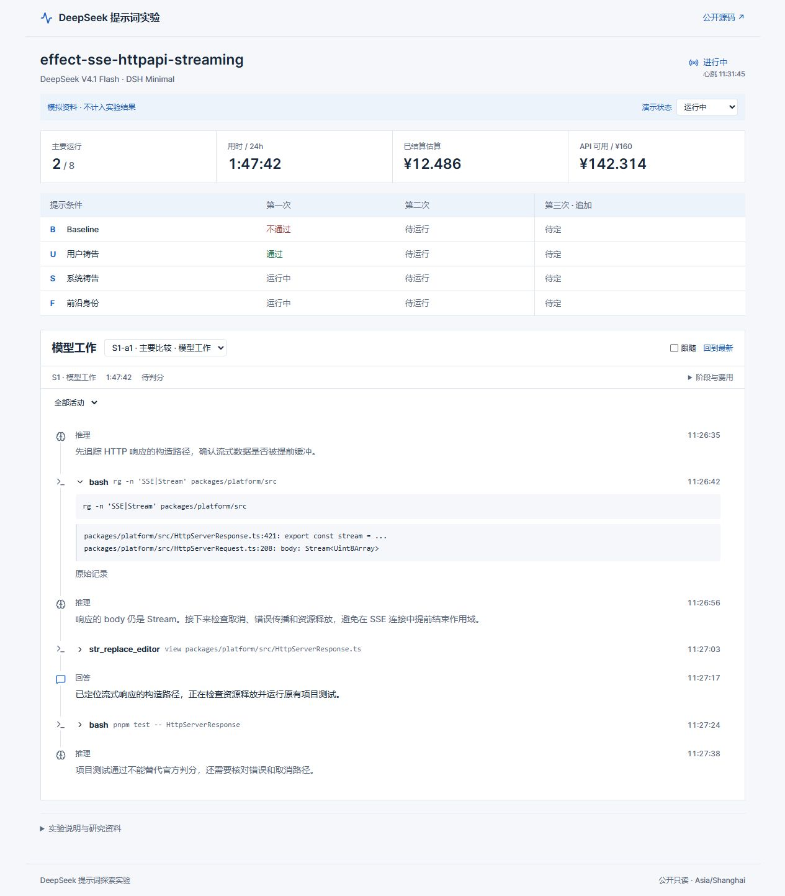

# 看板交付与验证记录

公开看板：https://deepseek-prompt-lab.javavirtualenv.chatgpt.site 。公开源码：https://github.com/Haedus-Industries/oh-my-god-deepseek 。

当前发布版本与源代码、部署及归档指纹保存在 `resources/dashboard.json`。Sites 使用官方 Worker starter、D1 与 R2，设置为公开只读；正式 Cloud 上传授权必须另行配置，不复用软件验证令牌。

- Python 全套 **31 项通过**，包括原生固定 SDK 的四组 16 个模拟请求、断流与账本、恢复及来源时间重建。
- Worker 与活动视图 **11 项通过**，覆盖公开读取、实验授权、重复／乱序／并发冲突、完整 UTF-8 下载、历史页边界、调用／输出配对及多块重组。
- TypeScript 检查、ESLint、正式构建通过。桌面与 390×844 手机检查完成，无整页横向溢出；矩阵可独立滚动。独立 reviewer 首审及复审完成，修复了重复说明、碎片化活动、历史游标漂移及异步跟随覆盖偏好。
- 实际联网上报验证完成：四组模拟活动 **28 条**、公开附件 **24 项**；完整 UTF-8 下载与凭据脱敏通过，发送队列恢复后待发送为 0，无效写入返回 401。临时授权已从 Sites 删除；撤销后的接口检查回执另存。所有验证仅上传软件模拟资料，付费 API 调用为 0。
- 没有付费模型调用。真实模型能力、Linux 容器隔离、镜像 digest 和 base/oracle 判分对照仍需在 Cloud 验证。

软件模拟资料带 `simulation=true`，不包含实验成功次数。验收测试保留在仓库；本地 JUnit、API 测试摘要与联网验证回执在被 Git 忽略的 `outputs/` 内，最终安全摘要会随源码保存。

页面验收截图（明确为模拟资料）：

